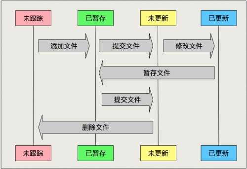

# git学习笔记第一章。
## 1.  使用git前的最小安装配置    
**在使用git前，需要配置你的用户名与你的邮箱， 这样你在与他人交涉时，可以有效知道对方的身份信息与联系方式**
1.  设置信息的操作方式
    ```git
    git config [--local | --global | --system] user.name 'Yourname' //设置您的用户名
    git config [--local | --global | --system] user.email 'Your email' //设置您的邮箱
    git config --list [--local | --global | --system] //查看您设置的信息
    git config --unset [--local | --global | --system] user.name // 清楚您设置的信息
    ```
2. 设置项的区别  
    **local是本地仓库，global是配置全局属性，system是当前操作系统的所有用户 权重逐级降低 加入local与global都有信息，那么会优先采用local设置的信息**
***
## 2. git的生命周期  **理解比记忆更重要**
   
2.1. 未跟踪  
    这种类型的文件属于在项目中，那些没有被添加至git管理的文件  
2.2. 已暂存  
    这种类型的文件属于在项目中，已交给git管理的文件  
2.3. 未更新  
    这种类型的文件属于在项目中，和上个版本比较无差异的文件  
2.4. 已更新
这种类型的文件属于在项目中，和上个版本比较有部分差异的文件

整个声明周期的流程如下 ： 新建文件（状态：未跟踪） -> git add [file_name] (状态：已暂存) -> 提交文件 git commit -m [message] (状态：未更新) -> git push (状态：未更新) -> 修改文件内容 (状态： 已更新) -> git add [file_name] (状态：已暂存)  **如此反复就组成了git的声明周期**
## 2. 日常使用基本命令
 1. 创建仓库
    ```git
    git init project_name  // 以上将会创建一个新的文件夹作为git仓库的根目录 如果已有项目使用以下方式
    git init //需要进入项目根目录后在执行此方法
    ```
    当我们创建好仓库后，会在根目录下生产一个 **.git** 的隐藏文件夹，里面包含了git仓库所需要的文件索引，以及版本号。
